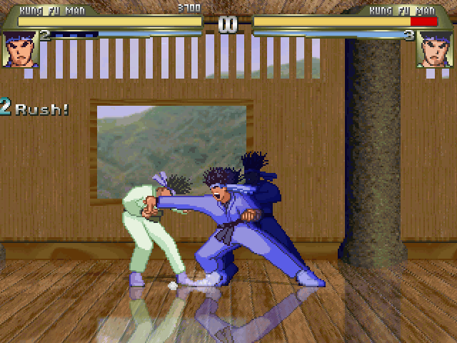
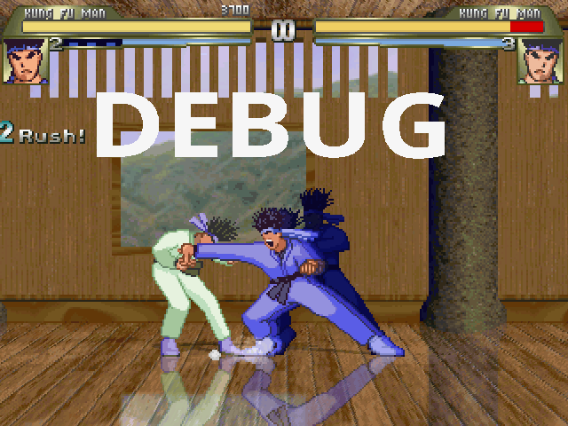

# Naruto R36S

<p align="center">
  
  
  
</p>

**Naruto R36S** es un port listo para usar de un juego de pelea fan-made de
Naruto, preparado para consolas R36S y otros dispositivos compatibles con
PortMaster en arquitectura `aarch64`.

El juego corre sobre **Ikemen GO**, un motor open source compatible con recursos
de M.U.G.E.N que agrega soporte moderno, scripting, modos extendidos y mejor
portabilidad. Este repositorio contiene el arbol del juego, launchers de
PortMaster, herramientas de desarrollo y el flujo para generar el paquete final.

## Caracteristicas

- Juego de pelea 2D basado en Naruto, powered by Ikemen GO.
- Paquete PortMaster `Ready to run`, sin runtime externo declarado.
- Launcher principal: `NarutoR36S.sh`.
- Launcher de debug: `NarutoR36SDebug.sh`.
- Herramienta de remapeo: `NarutoR36SGamepad.sh`.
- 157 carpetas de personajes incluidas en `chars/`.
- 35 definiciones de escenarios en `stages/`.
- Movelists en `moves/` y soporte de contenido de historia en `storymode/`.
- Binario ARM64 incluido: `ikemen_linux.aarch64`.
- Binario x64 local para pruebas de escritorio: `Ikemen_GO_Linux`.

## Instalacion En R36S / PortMaster

1. Genera el zip del port:

   ```bash
   tools/build-portmaster-release.sh
   ```

2. El paquete queda en:

   ```text
   dist/naruto-r36s.zip
   ```

3. Instala el zip con PortMaster o extraelo en la carpeta de ports de tu
   firmware. La estructura final debe quedar asi:

   ```text
   ports/
   |-- NarutoR36S.sh
   |-- NarutoR36SDebug.sh
   |-- NarutoR36SGamepad.sh
   `-- naruto-r36s/
       |-- chars/
       |-- data/
       |-- stages/
       |-- storymode/
       `-- ikemen_linux.aarch64
   ```

4. Desde el menu de ports ejecuta **Naruto R36S**.

Para remapear controles, abre **Naruto R36S Gamepad** desde Ports. Para probar
arranque con informacion de debug, usa **Naruto R36S (Debug)**.

## Controles

| Boton | Accion |
| --- | --- |
| Y | Golpe debil |
| X | Golpe fuerte |
| B | Patada debil |
| A | Patada fuerte |
| Start | Menu |
| Select | Taunt |

## Desarrollo Local

El root del repositorio es el arbol canonico del juego. Para probar en Linux x64:

```bash
tools/run-x64.sh
```

Para un smoke test rapido de arranque:

```bash
tools/smoke-x64.sh
```

El smoke test ejecuta Ikemen en modo ventana, sin musica ni sonido, actualizando
personajes y stages. Si la UI permanece viva hasta el timeout, se considera una
prueba correcta.

## Empaquetado

El script de release arma una estructura temporal de PortMaster y genera:

```bash
tools/build-portmaster-release.sh
```

Salida por defecto:

```text
dist/naruto-r36s.zip
```

Tambien puedes indicar una ruta de salida:

```bash
tools/build-portmaster-release.sh --output dist/mi-build.zip
```

O revisar que se copiaria sin crear el zip:

```bash
tools/build-portmaster-release.sh --dry-run
```

Durante el empaquetado se excluyen binarios x64, herramientas de editor, logs,
archivos temporales, metadata de Windows y carpetas antiguas de staging. El
paquete final queda separado del port oficial de Ikemen usando el directorio
`naruto-r36s/`.

## Estructura Del Repositorio

```text
.
|-- NarutoR36S.sh              # Launcher principal de PortMaster
|-- NarutoR36SDebug.sh         # Launcher con debug de Ikemen
|-- NarutoR36SGamepad.sh       # Remapeo de controles SDL
|-- chars/                     # Personajes
|-- data/                      # Configuracion, screenpack y datos de Ikemen
|-- external/                  # Configuracion externa, gamecontrollerdb, iconos
|-- font/                      # Fuentes
|-- lifebars/                  # Lifebars
|-- moves/                     # Movelists
|-- save/                      # Configuracion y datos de guardado
|-- sound/                     # Sonido y musica
|-- stages/                    # Escenarios
|-- storymode/                 # Scripts y catalogo del modo historia
|-- tools/                     # Scripts de desarrollo y release
|-- gameinfo.xml               # Metadata de juegos para frontend
`-- port.json                  # Metadata PortMaster
```

## Metadata Del Port

- Nombre: `Naruto R36S`
- Archivo PortMaster: `naruto-r36s.zip`
- Arquitectura: `aarch64`
- Porter: `leonkasovan`
- Motor: `Ikemen GO`
- Estado: `Ready to run`
- Carpeta de datos: `naruto-r36s/`

## Motor

Ikemen GO busca compatibilidad con recursos de M.U.G.E.N 1.1 Beta y suma
funciones propias del motor, como scripting avanzado, modos de juego ampliados y
mejor soporte multiplataforma. Este port usa esa base para correr el contenido de
Naruto dentro del entorno de PortMaster.

Mas informacion:

- Ikemen GO: <https://github.com/ikemen-engine/Ikemen-GO>
- Wiki de Ikemen GO: <https://github.com/ikemen-engine/Ikemen-GO/wiki>
- Documentacion de M.U.G.E.N: <https://www.elecbyte.com/mugendocs-11b1/mugen.html>

## Licencias Y Creditos

Gracias al equipo de **Ikemen GO** por desarrollar y liberar el motor.

Este es un proyecto fan-made. Naruto y sus marcas relacionadas pertenecen a sus
respectivos titulares. Revisa tambien los archivos de licencia incluidos en:

- `License.txt`
- `ScreenpackLicense.txt`
- `licenses/License.txt`
